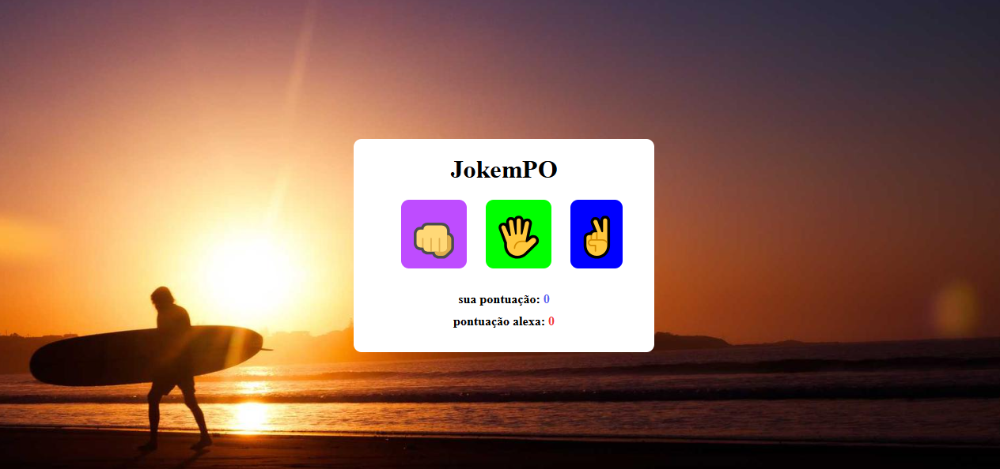

# ✊📄✂️ Jogo Pedra, Papel e Tesoura  

## 📸 Demonstração do Jogo  
<div align="center">
  
</div>


## 📌 Sobre o Projeto  
O **Pedra, Papel e Tesoura** é um jogo clássico desenvolvido com **HTML, CSS e JavaScript**. O objetivo é simples: escolha entre **Pedra (✊), Papel (📄) ou Tesoura (✂️)** e desafie o computador!  

O jogo segue as seguintes regras:  
✔ **Pedra** quebra **Tesoura** (✅ Pedra vence)  
✔ **Tesoura** corta **Papel** (✅ Tesoura vence)  
✔ **Papel** cobre **Pedra** (✅ Papel vence)  
✔ Escolhas iguais resultam em um **empate** ⚖️  

---

## 🚀 Tecnologias Utilizadas  
Este projeto foi desenvolvido utilizando as seguintes tecnologias:

<div align="center">
  
  
  
</div>  

---

## 🎮 Como Jogar  
1️⃣ **Clone este repositório**  
```sh
git clone https://github.com/seu-usuario/jogo-pedra-papel-tesoura.git

